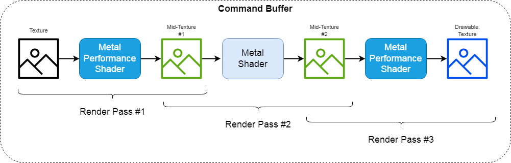
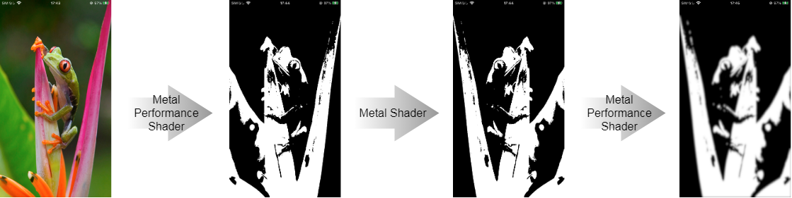

# MTL_MPS2MTL2MPSSample

Connect 3 render passes : Metal Performance Shader -> Metal  Shader -> Metal Performance Shader.

---
Note :
- It works only on the actual device.
- At the end of the code, an additional Metal Shader is run. This is to fit the image into MTKView.
---

